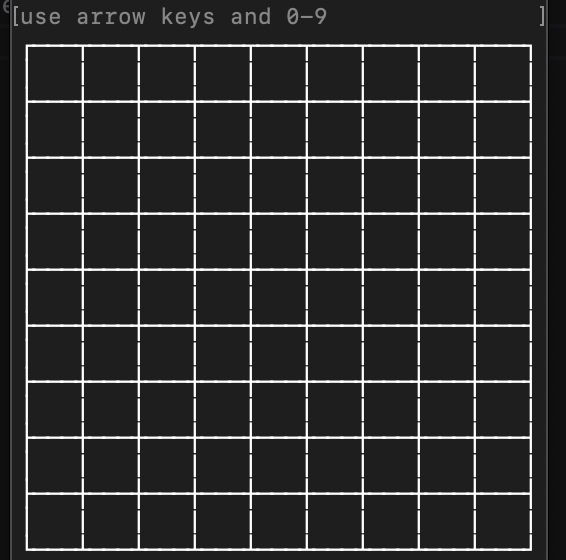
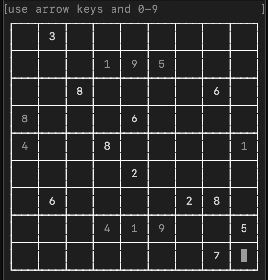
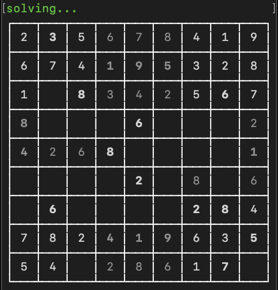
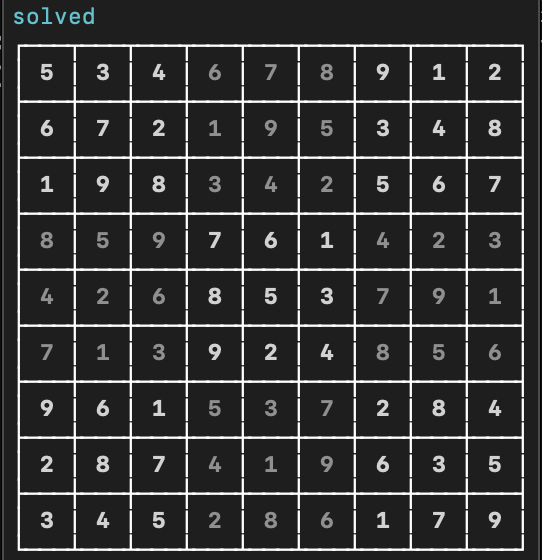
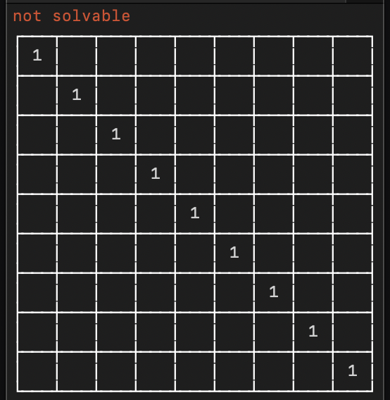
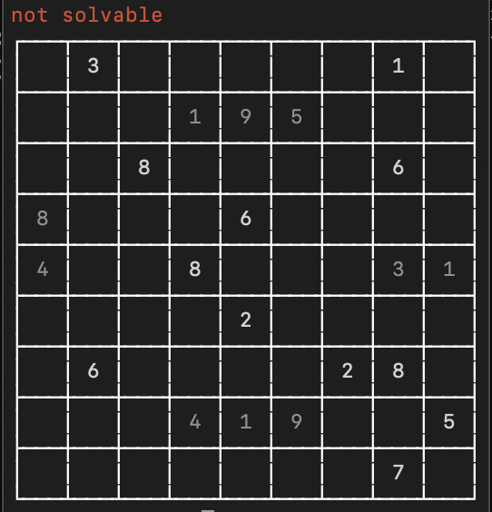

# sudoku solver

simple script to solve sudokus using recursive backtracking and optimized with a few rules

```bash
$ sudoku # displays grid for you to enter the puzzle into
$ sudoku path/to/file # reads text in as the puzzle
```

|   |   |  |
| :----------------------: | :-----------------------: | :-----------------------: |
|  |  |    |

### format

the format of the files the script will be reading should simply be 9 lines of numbers.
spaces will be replaced with zeroes before being parsed.
any character other than numbers will be stripped out and ignored, which means the following is valid:

```
1abc6defg
98!@#$6 5
[]{}|5  1
      3 4
 6 13 9  
 4 72    
 93 761  
  648   7
5  9 246 
```

### examples

- 1.txt (solvable)
- 2.txt (solvable)
- 3.text (unsolvable)